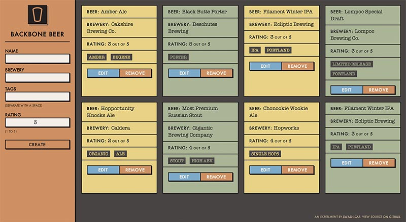

# Backbone Beer

_Because everything I do has to deal with beer, apparently._

**[View Project Demo &rarr;](http://www.swashcap.com/backbone-beer/)**

## Purpose

**The goal of this project is to learn [Backbone.js](http://backbonejs.org) basics.** The popular client-side JavaScript framework Backbone.js powers some of the [best and most trafficked sites](http://backbonejs.org/#examples) on the web. In an effort to improve my front-end skills, I embarked on a (continuing) project to study the framework and build a basic application.

## What It Is

This is a simple web application that allows users to enter beer items, along with some basic metadata (brewery, tags, and rating). Users are presented with an initial set of data, which they can add to, edit, or delete. The app exists solely in the browser by using [Backbone.localStorage](https://github.com/jeromegn/Backbone.localStorage)) to store information.

## What It Isn’t

Focusing on Backbone itself necessitated foregoing the tedium of building out a RESTful API back-end. Yes, Backbone.js persists data to the server effortlessly. However, building this functionality would have detracted from learning Backbone.js.

The app also does not incorporate a responsive design. This cut down on time required to make the UI. It’s best viewed on larger viewports.

The app is not optimized for production. Scripts are typically concatenated and assets are usually compressed in a typical single page application. Page load could be more performant; however, my plan was not to focus on a build process.

## Resources

I constantly relied on these quality resources:

* _[Official Backbone.js Documentationn](http://backbonejs.org)_
* _[Developing Backbone.js Applications](http://addyosmani.github.io/backbone-fundamentals/)_ by Addy Osmani
* [Backbone.js Wine Cellar Tutoriall](http://coenraets.org/blog/2011/12/backbone-js-wine-cellar-tutorial-part-1-getting-started/) by Christophe Coenraets
* [Backbone patterns](http://ricostacruz.com/backbone-patterns/) by Rico Sta. Cruz.
* Lots of [StackOverflow questions](http://stackoverflow.com/questions/tagged/backbone.js)
